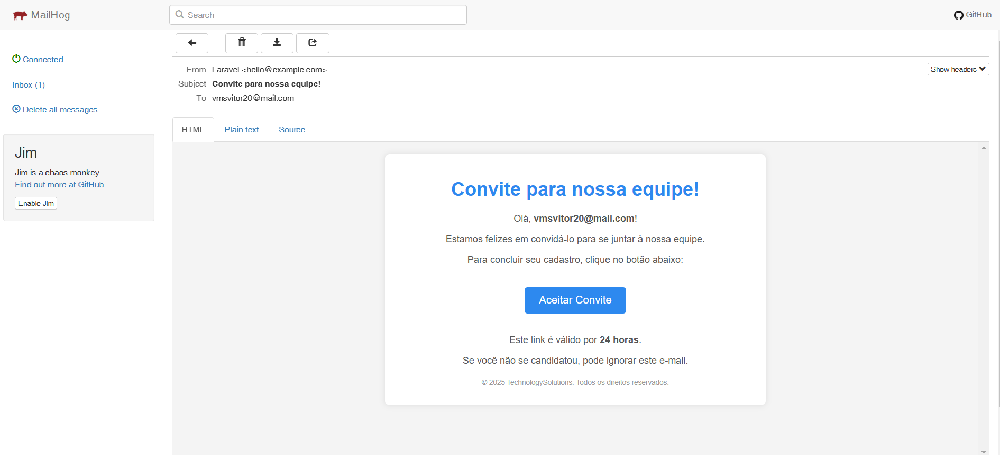

# RecrutMe - Back-end

Bem-vindo ao repositório do **RecrutMe** Back-end! Aqui você encontrará todas as informações necessárias para configurar e executar a API.

## 🚀 Tecnologias Utilizadas

-   **PHP**

-   **Laravel**

-   **Docker**

-   **Docker Compose**

-   **PostgreSQL**

-   **Mailhog**

## 📂 Repositório

Acesse o código-fonte do back-end no GitHub:

🔗 [RecrutMe Back-end](https://github.com/VitorMeloDS/recrut_me_back)

## 📥 Clonando o Projeto

Escolha um dos métodos abaixo para clonar o repositório:

### Usando HTTPS:

```sh

git  clone  https://github.com/VitorMeloDS/recrut_me_back.git

```

### Usando SSH:

```sh

git  clone  git@github.com:VitorMeloDS/recrut_me_back.git

```

Após clonar o projeto, entre no diretório:

```sh

cd  recrut_me_back

```

## 🔀 Mudando para a Branch de Desenvolvimento

Antes de iniciar, altere para a branch correta:

```sh

git  checkout  dev

```

## 🔧 Configuração do Arquivo `.env`

Crie um arquivo chamado `.env` e copie os valores do `.env.example` para ele:

```sh

cp  .env.example  .env

```

## 🛠️ Configuração do Ambiente

Crie uma rede Docker para comunicação entre os serviços:

```sh

docker  network  create  app_network

```

## ▶️ Executando a API

Para subir os containers do projeto, execute o comando abaixo:

```sh

docker  compose  up  -d

```

Isso irá iniciar a API em segundo plano.

## 🌐 Acessando a API

A API estará disponível no seguinte endereço:

🔗 [http://localhost:8000](http://localhost:8000)

📬 Visualizando E-mails com MailHog
Durante o desenvolvimento, foi utilizado o MailHog para capturar e-mails enviados pela aplicação.
Após iniciar os containers, acesse o MailHog pelo seguinte endereço:

🔗 http://localhost:8025



> **⚠️ Observação:** O front-end precisa estar em execução para que a aplicação seja acessível por interface gráfica.

---

📌 Desenvolvido por **Vitor Melo** 🚀
